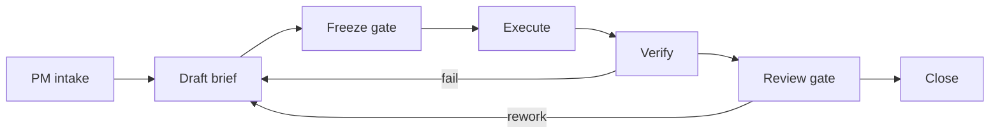

# .ai Workflow Governance

This file defines the stage gates for the local workflow runtime. The intent is
waterfall-like control with iterative loops: each task moves forward through a
clear gate, but failed validation returns to a new draft instead of mutating
the in-flight contract.

## Canonical Flow

## Stage Definitions

| Stage | Owner | Artifact | Exit rule |
| --- | --- | --- | --- |
| Intake | PM | `request.txt` | Scope is bounded enough to compile |
| Draft | PM | `task.yaml` with `governance.status: draft` | One bounded task, explicit acceptance, no placeholder implementation |
| Freeze | PM or reviewer | `task.yaml` with `governance.status: frozen` | Scope is frozen and ready for execution |
| Execute | OMC / OMX | `result.md` | Minimal edits, minimal checks, no scope expansion |
| Review | Codex gate | Review notes or follow-up issues | Trigger only on convergence points or high-risk changes |
| Close | PM | Final decision in `result.md` | Pass, rework, or split into a new brief |

## Governance Rules

1. One `task.yaml` equals one bounded change.
2. Drafts may be revised; frozen tasks are execution-only.
3. If scope changes after freeze, create a new draft instead of widening the task.
4. `bridge.sh` must reject unfrozen tasks.
5. `brief.sh` is compile-only. It must not run executors.
6. `freeze.sh` is the approval gate. It promotes a draft to a frozen contract.
7. `bridge.sh` is execute-only. It must not accept raw request text.
8. Review gates are mandatory for cross-cutting or high-risk work, not for every small edit.
9. Results should only summarize summary, changed files, test results, and risks.
10. Hidden runtime state such as `.codex/` and `.omx/` is not source of truth.

## Rework Rule

If execution fails, do not mutate the frozen task in place. Write a new draft,
adjust scope, freeze again, and rerun the bridge. This keeps each iteration
auditable and prevents scope drift.
