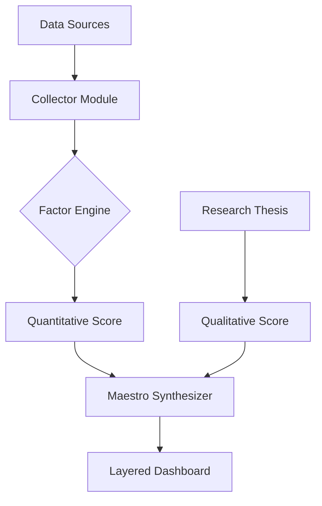

# Architecture: Hybrid Factor-Decision Engine

## 1. High-Level Architecture

## 2. Component Breakdown

### 2.1 Collector Module
- **yfinance (Global)**: Fetches OHLCV and 기본(Basic) fundamentals.
- **FinMind (Taiwan)**: Fetches specialized TW data (ROE, 籌碼/Institutional flow).
- **Scheduled Job**: Runs via GitHub Actions or local CRON.

### 2.2 Factor Engine (Transformer)
- **Vectorized Computation**: Uses `pandas` for efficient math.
- **Normalization Engine**: Computes Z-scores against the current `source_registry.json` universe.
- **Snapshot Logic**: Writes `factor_snapshot` to each ticker's `state.json`.

### 2.3 Layered Dashboard (Presenter)
- **Level 1 (Cockpit)**: High-level `Maestro Score` and current recommendation.
- **Level 2 (Analytics)**: Factor Radar Chart (Quality/Value/Momentum) + Narrative Summary.
- **Level 3 (Evidence)**: Historical events, raw financial data, and full research notes.

## 3. Progressive Disclosure (UI Strategy)
- The dashboard is no longer a single flat list.
- Each ticker becomes a **drill-down card**.
- Use **Tooltips** and **Expandable Sections** to keep the primary view clean.
