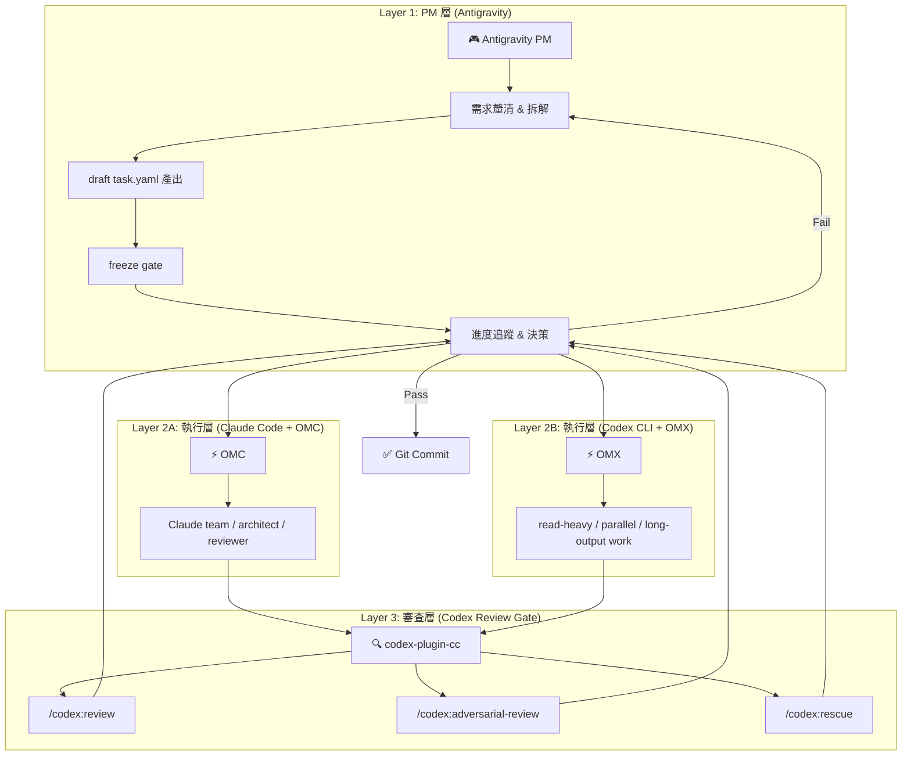
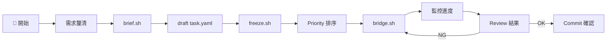
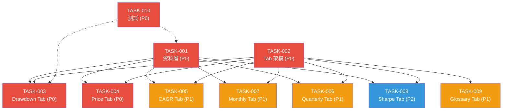
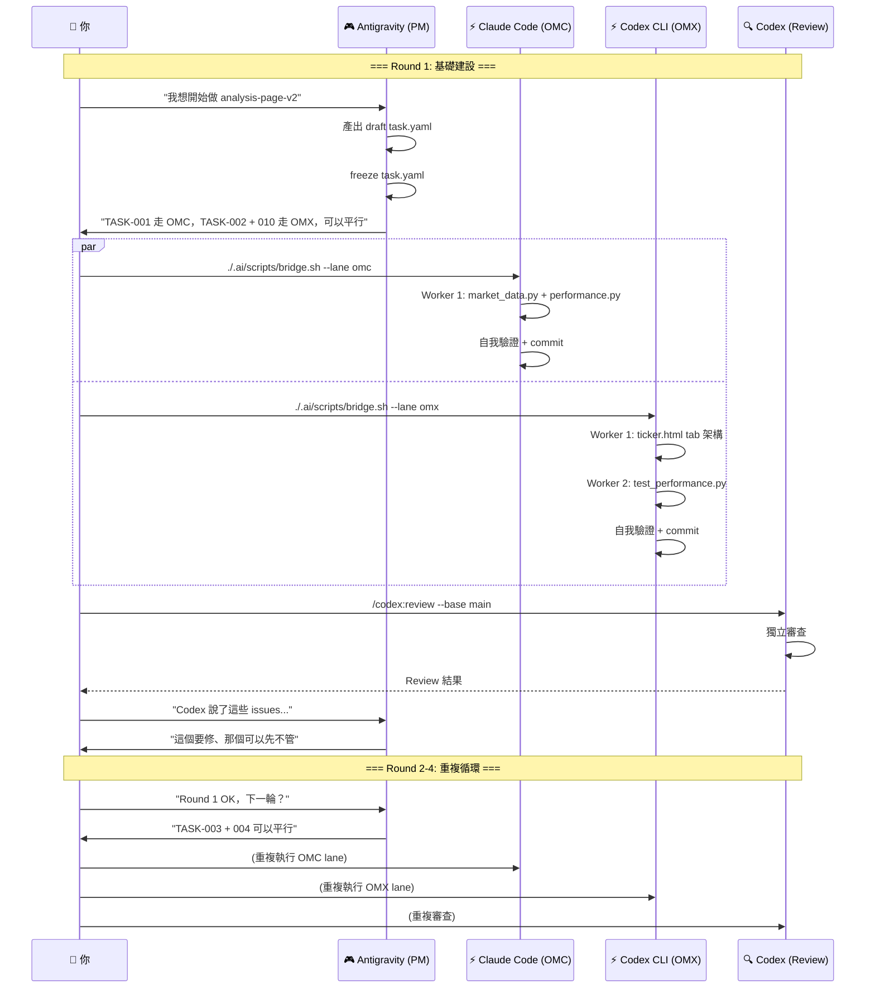

# 四段式治理工作流：Antigravity PM + Brief Freeze + OMC / OMX Execution + Codex Review

**目標**：建立一套可執行的開發流程，讓 Antigravity 作為 PM 前端對話，先用 `brief.sh` 壓縮成 draft，再用 `freeze.sh` 凍結成執行契約，然後由 Claude Code OMC 與 Codex CLI OMX 分別承擔不同型態的執行工作，Codex review gate 則只在收斂點介入。
**首個應用場景**：`analysis-page-v2`（單一股票分析頁 + Maximum Drawdown 頁）
**Canonical handoff**：PM -> `./.ai/scripts/brief.sh` -> draft `.ai/handoff/task.yaml` -> `./.ai/scripts/freeze.sh` -> frozen `.ai/handoff/task.yaml` -> `./.ai/scripts/bridge.sh` -> OMC / OMX executor -> `.ai/handoff/result.md`

---

## 系統架構總覽



---

## User Review Required

> [!IMPORTANT]
> **角色分工確認**：以下方案假設你在 Antigravity 對話面板做 PM 決策，同時用 Claude Code + OMC 與 Codex CLI + OMX 兩條 lane 執行。請確認這是你期望的操作模式。

> [!WARNING]
> **OMC Team 模式**：你的 Claude Code 終端已顯示 OMC v4.9.3 已安裝，但 Team 模式需要 `CLAUDE_CODE_EXPERIMENTAL_AGENT_TEAMS=1` 環境變數。請確認是否已設定。

> [!WARNING]
> **OMX 狀態**：請確認 `oh-my-codex` 已安裝並通過 `omx doctor`。OMX 是 Codex CLI lane，不是 OMC 的替代品。

> [!IMPORTANT]
> **Codex Plugin 狀態**：請確認 `codex-plugin-cc` 是否已安裝並通過 `/codex:setup`，以及 Codex CLI 是否已登入。review gate 只在收斂點使用。

---

## Phase 0: 開發前準備（一次性）

### 0.1 環境驗證 Checklist

在 Antigravity 整合終端機執行：

```bash
# 基礎工具
claude --version        # 確認 Claude Code CLI
codex --version         # 確認 Codex CLI
omx --version           # 確認 oh-my-codex
tmux -V                 # 確認 tmux（OMC Team 需要）

# OMC 狀態
# 進入 Claude Code 後執行：
# omx doctor
# /codex:setup

# OMX 狀態
omx doctor
```

### 0.2 Bridge 契約建立

確認 `.ai/handoff/task.yaml.template`、`.ai/handoff/result.md.template`、`./.ai/scripts/brief.sh`、`./.ai/scripts/freeze.sh`、`./.ai/scripts/bridge.sh` 是否已存在且可執行。
如果要跑 `omx explore`，先確認 `omx doctor` 沒有未解決的 warning，尤其是 explore backend。

### 0.3 將產品 spec 與 workflow contract 分離

- `docs/daily/future_0401.md` 與 `docs/daily/implementation_plan.md` 是產品 / 實作 spec。
- `.ai/handoff/task.yaml` 只有在 `governance.status: frozen` 時才是執行器入口。
- `docs/briefs/` 與 `.omc/` 內的 plan 只當作局部工作記錄，不是主線 contract。

---

## Phase 1: PM 層工作流（你 + Antigravity）

### 1.1 每輪開發循環 — PM 端



**你在 Antigravity 面板做的事：**

| 步驟 | 動作 | 產出 |
|------|------|------|
| 1 | 與我討論、聚焦需求 | 確認下一個要做的 TASK |
| 2 | 我幫你壓縮成 draft 工單 | `.ai/handoff/task.yaml` |
| 3 | 確認 Priority & 依賴 | 排好可平行的 task 組 |
| 4 | 你先跑 `./.ai/scripts/brief.sh`，再跑 `./.ai/scripts/freeze.sh`，再跑 `./.ai/scripts/bridge.sh` | 啟動 OMC / OMX 執行 |
| 5 | 等待完成，回來跟我確認 | 我幫你看 `result.md` & 判斷品質 |
| 6 | 觸發 Codex Review | `/codex:review` |
| 7 | 收到 Review 後跟我討論 | 決定 pass / rework |

### 1.2 PM Prompt 模板

當你要跟我討論下一步時，可以用：

```
老闆模式：我想做 TASK-XXX，幫我確認：
1. 前置依賴是否已完成？
2. 可以跟哪些 task 平行？
3. 預估風險是什麼？
4. 幫我壓縮成 draft `.ai/handoff/task.yaml`
5. 幫我確認是否可以 freeze
```

---

## Phase 2: 執行層工作流（Claude Code + OMC）

### 2.1 單 Task 執行 Prompt（OMC lane）

當 PM 層確認好要做哪個 TASK，你在 Claude Code 終端貼：

```text
./.ai/scripts/brief.sh "TASK-XXX：<bounded request>"
./.ai/scripts/freeze.sh
./.ai/scripts/bridge.sh --lane omc
```

### 2.2 平行 Task 執行（OMC Team 模式）

當有多個可平行的 task 時，使用 OMC Team：

```text
/team 3:executor "依以下順序平行執行：
- Worker 1: TASK-001 (market_data.py + performance.py)
- Worker 2: TASK-002 (ticker.html tab 架構)
- Worker 3: TASK-010 (test_performance.py 先寫測試)
每個 worker 讀對應的 `.ai/handoff/task.yaml` 與必要的 `docs/daily/*` spec，不把 `.omc/plans` 當 source of truth。"
```

### 2.3 平行 Task 執行（OMX Codex lane）

當 task 以讀取、平行實作、長輸出整理為主，而且不需要 Claude team 的高歧義規劃時，改用 OMX：

```text
./.ai/scripts/brief.sh "TASK-XXX：<bounded request>"
./.ai/scripts/freeze.sh
./.ai/scripts/bridge.sh --lane omx
```

### 2.4 Task 依賴圖 — analysis-page-v2



> 🔴 = P0（必做） | 🟡 = P1（核心完整） | 🔵 = P2（進階）

### 2.4 最佳平行策略

根據依賴圖，建議分 **4 輪** 執行：

| 輪次 | 可平行 Tasks | 執行方式 | 預估 |
|------|-------------|---------|------|
| **Round 1** | TASK-001 + TASK-002 + TASK-010(部分) | `./.ai/scripts/brief.sh` + `freeze.sh` + `bridge.sh --lane omc` / `--lane omx` | 後端 + 前端架構 + 測試骨架同時開 |
| **Round 2** | TASK-003 + TASK-004 | `/team 2:executor` | 兩個 P0 前端 tab 平行 |
| **Round 3** | TASK-005 + TASK-006 + TASK-007 + TASK-009 | `./.ai/scripts/brief.sh` + `freeze.sh` + `bridge.sh --lane omc` / `--lane omx` | 四個 P1 tab，3 worker 分配 |
| **Round 4** | TASK-008 | 單一 session | P2 Sharpe Tab |

---

## Phase 3: 審查層工作流（Codex Review Gate）

### 3.1 每輪完成後的標準審查

```text
# 常規 review
/codex:review --base main --background

# 等待完成
/codex:status

# 取得結果
/codex:result
```

### 3.2 P0 完成後的壓力測試審查

Round 1 + Round 2 全部完成後（即 P0 完畢），做一次 adversarial review：

```text
/codex:adversarial-review --base main
```

### 3.3 Review 結果回流 PM 層

Codex 的 review 結果回到 Antigravity PM 層討論，且只在 bounded chunk 完成後使用：
- **Pass** → 確認 commit，更新 `.ai/handoff/result.md`
- **Issues Found** → 你回來告訴我 issues，我幫你判斷是否需要 rework
- **Rescue** → 如果卡住，用 `/codex:rescue` 讓 Codex 調查

---

## 完整 Swimlane 流程



---

## 操作紀律

### DO ✅

1. **每輪開始先跟 PM（我）確認** scope 和 priority
2. **每輪只跑 2-3 個平行 task**，不要一次全開
3. **每輪結束都跑 Codex Review**，不要攢到最後
4. **Claude Code 每輪都 commit**，保持可回溯
5. **遇到卡關先回 PM 層討論**，不要在 Claude Code 裡死磕

### DON'T ❌

1. 不要在 Antigravity PM 層直接寫程式碼（那是 Claude Code 的事）
2. 不要跳過 Codex Review 就進下一輪
3. 不要同時修改同一個檔案的不同 worker
4. 不要把 analysis data 塞進現有 `digest.json`（獨立 payload）
5. 不要讓 Claude Code 自評自過（那是 Codex 的職責）

---

## 快速參考卡

### 在 Antigravity（跟我）

```
"幫我確認 TASK-XXX 的前置依賴"
"Review 結果有這些 issues，怎麼處理？"
"這輪完成了，下一輪該做什麼？"
"幫我壓縮成 draft `.ai/handoff/task.yaml`"
"幫我確認是否可以 freeze"
```

### 在 Claude Code 終端

```text
# draft + freeze + execute
./.ai/scripts/brief.sh "TASK-XXX..."
./.ai/scripts/freeze.sh
./.ai/scripts/bridge.sh --lane omc

# 平行 tasks
./.ai/scripts/brief.sh "TASK-XXX..."
./.ai/scripts/freeze.sh
./.ai/scripts/bridge.sh --lane omx

# 狀態檢查
omx doctor

# OMC / OMX mainline
cat .ai/handoff/result.md
```

### 在 OMX 終端

```text
omx doctor
./.ai/scripts/brief.sh "..."
./.ai/scripts/freeze.sh
./.ai/scripts/bridge.sh --lane omx
omx team status <team-name>
```

### 在 Codex Review Gate

```text
/codex:review --base main --background
/codex:status
/codex:result
/codex:adversarial-review --base main
/codex:rescue
```

---

## Open Questions

> [!IMPORTANT]
> **Q1**：你目前 OMC Team 模式是否已驗證可用？（需要 tmux + `CLAUDE_CODE_EXPERIMENTAL_AGENT_TEAMS=1`）

> [!IMPORTANT]
> **Q2**：Codex Plugin 是否已安裝完成？如果還沒裝，要先跑 Phase 0。

> [!WARNING]
> **Q3**：`analysis-page-v2.md` 目前只有一份 plan，是否需要先拆成 OMC / OMX 都能消費的 task list，讓 lane 分工更穩？

---

## Verification Plan

### Automated Tests
- 每輪完成後：`pytest tests/test_performance.py tests/test_market_data.py`
- 前端驗證：使用 `webapp-testing` skill（Playwright）檢查 tab 切換、元素重疊
- Codex Plugin：`/codex:review` + `/codex:adversarial-review`

### Manual Verification
- 你在瀏覽器開 `site/index.html` 確認 ticker 頁面 tab 正常
- 確認 `research/<ticker>/artifacts/` 底下有正確的 JSON artifacts
- 確認 `.ai/handoff/result.md` 有被正確更新
