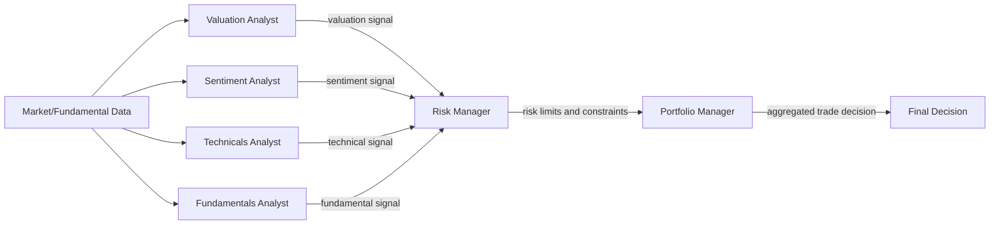

# ai-hedge-fund 架構參考

## 1. 專案概述

[`virattt/ai-hedge-fund`](https://github.com/virattt/ai-hedge-fund) 是一個以教育與研究為導向的多 Agent 投資決策 proof of concept。依其 [README](https://github.com/virattt/ai-hedge-fund/blob/main/README.md) 與公開架構整理，核心設計是讓多個分析師 Agent 先各自產生 signals，再交由 `Risk Manager` 做風險約束，最後由 `Portfolio Manager` 聚合成最終決策。補充架構脈絡可參考 DeepWiki 的 [Main Application](https://deepwiki.com/virattt/ai-hedge-fund/3.1-main-application) 頁面；該頁屬於架構整理來源，不應視為官方規格本身。

## 2. 核心架構圖

這個架構的重點不是單一模型直接下單，而是把分析、風控、決策拆成不同責任層。分析師負責形成觀點，`Risk Manager` 負責限制部位與風險暴露，`Portfolio Manager` 再根據前面輸入做最後聚合。

## 3. 與目前 STOCK 專案的整合可行性分析

| 分類 | 內容 | 對 STOCK 的意義 |
| --- | --- | --- |
| 可直接借用的設計模式 | 多分析師分工、signal aggregation、先風控後 PM 的決策順序 | 適合拿來整理 `STOCK` 未來的 agent 責任邊界，避免把分析與決策混在同一層。 |
| 需要自行實作的部分 | analyst signal schema、agent contract、state schema、決策輸出格式、與現有資料流的接點 | `STOCK` 必須依自己的資料來源與研究流程重建內部介面，不能直接照搬外部 repo 的狀態模型。 |
| 不適合引入的部分 | 直接搬用完整 LangGraph 編排、原專案 web app、特定執行環境與依賴組合 | `STOCK` 當前目標是建立可控的研究與決策架構，不需要先承擔整包前後端與外部框架的整合成本。 |

## 4. 建議下一步

1. 先在 `STOCK` 定義統一的 analyst signal schema，至少包含 `signal`、`confidence`、`reasoning`、`risk_flags`。
2. 先做一條最小可用 PoC：`Fundamentals Analyst + Technicals Analyst -> Risk Manager -> Portfolio Manager`，確認資料流與輸出格式。
3. 等核心決策鏈穩定後，再評估是否需要引入更重的 orchestration layer 或視覺化 flow editor。
