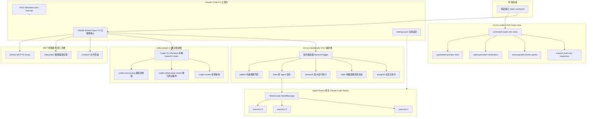
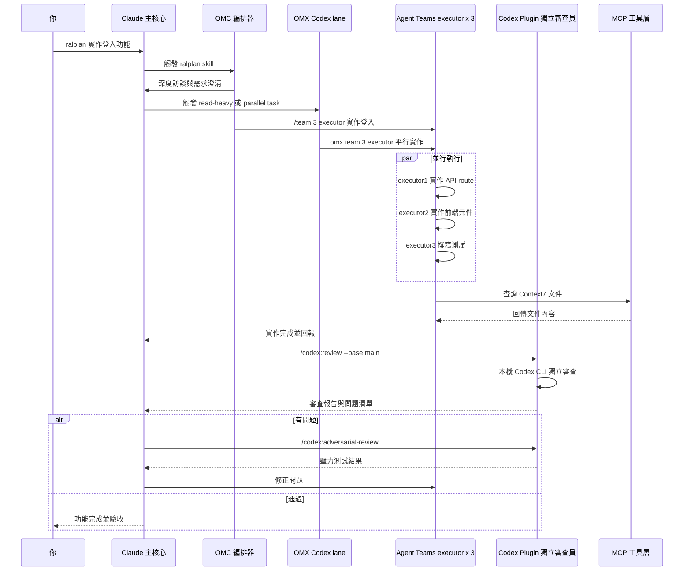

> Archived snapshot.
> Active workflow lives in `rules/orc-architecture.md`, `.agent/skills/pm/SKILL.md`, `.ai/README.md`, `.ai/scripts/bridge.sh`, and `docs/architecture/implementation_plan.md`.
> Do not treat this file as source of truth.

已重構成可直接使用、層次清楚、語法正確的 Markdown。保留原始內容意圖，但修正了：

* Mermaid 與一般 Markdown 混寫不清
* `graph` / `sequenceDiagram` 未包 code fence
* 表格與段落層級混亂
* 名稱不一致（OMC / OMX / Codex lane / Claude lane）
* 說明段落與規則段落未分層

以下是整理後版本。來源：

---

# OMC + OMX + Codex Plugin + Claude 協作架構

## 1. 架構總覽

這套協作架構可分為五層：

1. 使用者輸入層
2. Claude / Claude Code 主核心層
3. OMC 編排層
4. OMX 與 Codex 驗證層
5. MCP 外部工具層

核心原則如下：

* Claude lane 負責主要推理、規劃與實作
* OMC 負責 Claude lane 的任務編排與 agent orchestration
* OMX 負責 Codex lane 的 read-heavy、平行驗證與持久化 state
* codex-plugin-cc 作為獨立驗證層，只在 bounded chunk 完成後介入
* MCP 提供文件、檔案與 GitHub 等外部工具能力

---

## 2. 整體分層架構圖



---

## 3. 工作流程：從需求到驗收



---

## 4. 元件分層說明

### 4.1 Claude 主核心層

| 元件                       | 角色    | 說明                              |
| ------------------------ | ----- | ------------------------------- |
| Claude Sonnet / Opus 4.6 | 主推理核心 | 負責對話、規劃、程式撰寫與高層決策。可依任務深度切換模型能力。 |

---

### 4.2 OMC：oh-my-claudecode 編排層

OMC 是掛在 Claude Code 上的智慧排程器，負責 Claude lane 的規劃、team orchestration 與高歧義拆解。

| OMC 技能         | 關鍵字觸發            | 用途                          |
| -------------- | ---------------- | --------------------------- |
| autopilot      | `autopilot`      | 從需求到可運行程式碼的一次性完成            |
| ralph          | `ralph:`         | 持續迴圈執行，自我驗證直到完成             |
| ultrawork      | `ulw`            | 啟動多個 agent tier 進行最大並行處理    |
| ralplan        | `ralplan`        | 先做需求共識與規劃門禁，再進入執行           |
| team           | `/team N:type`   | 指派 N 個指定類型 agent 處理共享任務     |
| deep-interview | `deep interview` | 用訪談方式將模糊需求逼近為精確規格           |
| trace          | 無固定關鍵字           | 多 tracer 並行追根究底找 root cause |

補充規則：

* `ralph` 已內含 `ultrawork`
* 一般不建議同時手動啟用 `ralph` 與 `ultrawork`

---

### 4.3 OMX：oh-my-codex Codex lane

OMX 是掛在 OpenAI Codex CLI 上的工作流層，負責 read-heavy、parallelizable、長輸出整理與持久化 state。

| OMX 技能     | 關鍵字觸發        | 用途                      |
| ---------- | ------------ | ----------------------- |
| explore    | `explore`    | 唯讀探索與 repo scan         |
| team       | `team`       | 使用 tmux 平行 worker panes |
| ralph      | `ralph`      | 持續迴圈直到驗證完成              |
| sparkshell | `sparkshell` | 長輸出摘要與 operator shell   |
| notepad    | `notepad`    | 持久記憶與 project state     |

補充規則：

* `.omx/` 僅保存本機 runtime state
* `.omx/` 不應作為 repo source of truth

---

### 4.4 Agent Teams 協作執行層

此層由 `CLAUDE_CODE_EXPERIMENTAL_AGENT_TEAMS=1` 開啟。
每個 teammate 都是一個完整的 Claude Code session，透過 `TeamCreate`、`SendMessage`、`TaskCreate` 進行溝通。

常見配置：

* 預設 3 個 executor，兼顧速度與資源
* executor：通用程式實作
* debugger：專攻 build 與型別錯誤
* designer：前端與 UI 任務

HUD 可即時顯示每個 agent 的狀態與進度。

---

### 4.5 codex-plugin-cc 獨立驗證層

Codex plugin 的核心設計是讓不同 lane 的 agent 來做驗證，避免自評自過。
此層應在 bounded chunk 完成後再介入，而不是從頭全程常駐。

| 指令                          | 用途                              |
| --------------------------- | ------------------------------- |
| `/codex:review --base main` | 對比 main branch 進行標準 code review |
| `/codex:adversarial-review` | 以壓力測試方式主動找問題                    |
| `/codex:rescue`             | 將 bug 調查與修復委派給 Codex            |

補充規則：

* 底層為本機 Codex CLI
* 優點是速度快、可離線、與主 lane 分離

---

### 4.6 MCP 工具層

| 伺服器        | 功能                                    |
| ---------- | ------------------------------------- |
| Context7   | 查詢主流函式庫官方文件，例如 React、Next.js、Postgres |
| Filesystem | 擴展檔案存取範圍到整個 home 目錄                   |
| GitHub MCP | 讀寫 GitHub PR、Issue、Repo，通常需要額外授權      |

設計原則：

* Context7 用於降低對模型記憶的依賴
* Filesystem 用於跨目錄檔案存取
* GitHub MCP 用於 PR / Issue / repo 操作整合

---

## 5. HUD Statusline

HUD Statusline 用來即時顯示當前執行狀態，通常在重啟後生效。

範例：

```text
[OMC] branch:main | ralph:3/10 | ultrawork | ctx:67% | agents:2 | todos:2/5
  ├─ O architect    2m   analyzing architecture patterns...
  └─ e executor     45s  implementing validation logic
```

欄位說明：

| 欄位            | 說明                       |
| ------------- | ------------------------ |
| `branch:main` | 目前所在 branch              |
| `ralph:3/10`  | 第 3 輪，最多 10 輪            |
| `ctx:67%`     | context 使用量，超過 85% 通常要警戒 |
| `agents:2`    | 目前有 2 個 subagent 正在執行    |
| `todos:2/5`   | 任務清單進度                   |

---

## 6. 建議操作原則

### 6.1 適合 OMC 的情境

* 高歧義需求
* 需要規劃門禁
* 需要多 agent 協作實作
* 需要持續迴圈直到完成

### 6.2 適合 OMX 的情境

* read-heavy 探索
* repo scan
* 長輸出整理
* 平行 worker panes
* 持久化本機 state

### 6.3 適合 codex-plugin-cc 的情境

* bounded chunk 完成後的驗證
* 主動找潛在問題
* bug 調查與修復委派

### 6.4 不建議的用法

* 讓所有層同時處理同一件事
* 在一開始就啟用過多 lane
* 用 Codex plugin 取代主要實作流程
* 把 `.omx/` 當作正式專案資料來源

---

## 7. 一句話總結

這套架構的本質不是「單一 agent 解決全部」，而是將：

* Claude 作為主核心
* OMC 作為 Claude lane 的編排器
* OMX 作為 Codex lane 的工作流層
* codex-plugin-cc 作為獨立驗證器
* MCP 作為外部工具能力

做成一個可分工、可平行、可驗證、可收斂的協作系統。
