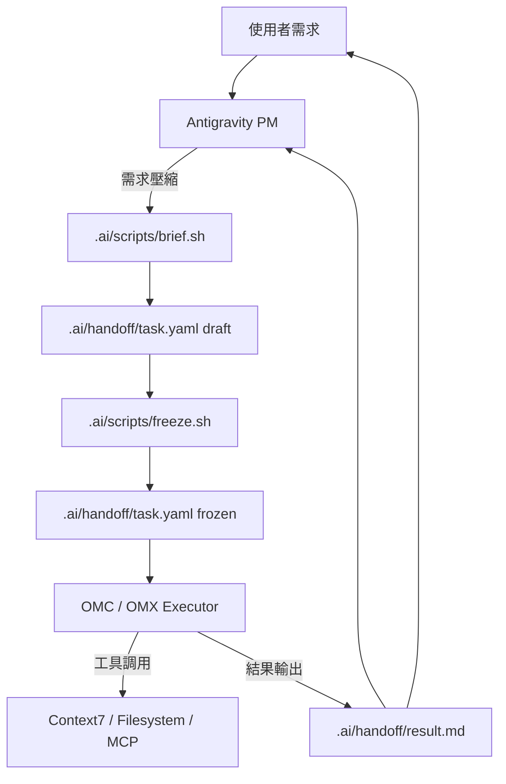

# Antigravity x OMC 協作架構 (Orc v3)

本架構建立「需求編譯器 (PM)」、「凍結閘門 (Freeze)」與「帶工具執行器 (Executor)」之間的責任分界與 handoff 機制。

## 1. 架構總覽

核心角色分工：
- **Antigravity (PM)**：需求編譯器。負責訪談、限制條件制定、驗收條件定義與 draft 產出。不直接執行改檔。
- **Freeze Gate**：治理閘門。負責把 draft 升級成 frozen contract。未凍結的 task 不得進入執行層。
- **OMC (Executor)**：主要執行器。讀取 frozen `task.yaml` 後在 Claude Lane 進行外科手術式修改。
- **OMX (Executor)**：輔助執行器。負責 Repo Scan、長輸出摘要、平行驗證。
- **Codex Plugin**：獨立驗證層。在高風險修改後進行 adversarial review。

本機推薦入口分成三段：
- `./.ai/scripts/brief.sh`：把原始需求編譯成 draft `task.yaml`。
- `./.ai/scripts/freeze.sh`：把 draft 提升成 frozen contract。
- `./.ai/scripts/bridge.sh`：只讀 frozen task，然後依 lane 路由到 `claude -p` (OMC) 或 `omx exec` (OMX)。

## 2. Handoff 資料流 (Data Flow)

為減少 Token 浪費與上下文重疊，雙方只透過 `.ai/handoff/` 交換最小資訊：

1. **`request.txt`**：原始使用者需求紀錄。
2. **`task.yaml` draft**：由 PM 編寫的最小規格工單。
   - `governance.status: draft`
   - `goal`, `scope`, `constraints`, `acceptance`, `output`
3. **`task.yaml` frozen**：經 freeze gate 凍結後的執行契約。
   - `governance.status: frozen`
4. **`result.md`**：由執行器回傳的任務摘要。
   - `summary`, `changed_files`, `test_results`, `risks`

## 2.5 Launcher Contract

`brief.sh` 是 compile-only，`freeze.sh` 是治理閘門，`bridge.sh` 是 execute-only。三者分工不能混用。

- PM 產生 request 後，由 `brief.sh` materialize `request.txt` 與 draft `task.yaml`。
- PM 或 reviewer 確認 draft 沒有 scope drift 後，由 `freeze.sh` 將 task 升級為 frozen。
- Executor 只讀 frozen `task.yaml`。
- 結果只回寫到 `result.md`。
- `.codex/` 與 `.omx/` 是 hidden runtime state，不是 repo source of truth。
- 更完整的 stage gate 與 rework 規則記在 [`.ai/governance.md`](../.ai/governance.md)。

## 3. 營運原則 (Operational Principles)

### 3.1 PM 規則 (Spec Compiler Rules)
- **短 Spec**：工單內每一欄位應最短化。
- **Draft 可改，Frozen 不改**：如果 scope 變動，先回到 draft，再重新 freeze。
- **不解釋**：不將整段對話上下文傳給執行器。
- **固定限制**：明確定義 `no db schema change`, `minimum file edits` 等。

### 3.2 執行器規則 (Executor Rules)
- **外科手術修改**：優先進行局部精準修改，而非大範圍重構。
- **最小化讀取**：第一輪最多只讀取 5 個相關檔案。
- **最小化測試**：只跑與變更直接相關的單一測試路徑。
- **工具精簡**：僅在必要時開啟 Context7 (文檔) 或 Filesystem。
- **不改範圍**：executor 不得自行擴張 task 範圍或重新定義 acceptance。

## 4. 驗證層觸發情境

Codex Plugin 審查應在以下收斂點後啟動：
- 修改超過 3 個關鍵檔案。
- 涉及 Auth / Payment / State Management 邏輯。
- 需要 Merge 前。
- 執行器標記為高風險時。

## 5. 一句話定義

**Antigravity 是需求編譯器，Freeze 是治理閘門，OMC / OMX 是執行器；兩者間只交換工單，不交換會議錄音。**
